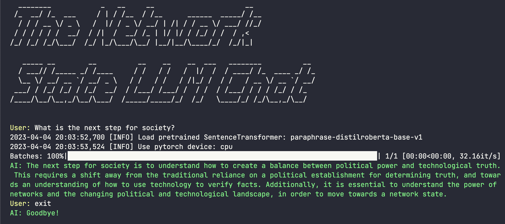

# The Network State LLM Chat

The Network State LLM Chat is a Python-based project that creates a chat interface for [the network state book](https://thenetworkstate.com). It processes the book, divides it into chunks, and creates embeddings using Hugging Face's Sentence-BERT. The embeddings are stored using the FAISS library on disk in the cache/ directory. The chat interface is a simple Python terminal TUI that uses a Language Model API to answer user queries based on the book's context.




## Architecture
The project consists of several components:

- book_processing.py: Handles processing of the PDF file and extracts text in chunks.
- sbert_embeddings.py: Creates embeddings for the text chunks using Sentence-BERT.
- faiss_storage.py: Stores the embeddings in a FAISS index on disk.
- chat_interface.py: Implements a simple terminal-based chat interface.
- config.py: Contains configuration variables such as the book path and cache directory.
- llm_api.py: Provides a function to complete prompts using a Language Model API.
- cli.py: Orchestrates the execution of the different components.


## Prerequisites
To run the project locally, you need to have Python 3.7 or higher installed. You also need to install the required Python libraries.

You can setup your system by following the instructions below.

### Setup
Clone the repository and download the book PDF file:
```sh
# Get the code
$ git clone https://github.com/adkri/the-network-state-llm.git
$ cd the-network-state-llm

# Download the network state book
$ curl -o book.pdf https://book.thenetworkstate.com/tns.pdf
```

We need to setup a Python virtual environment to 
```sh
$ python3 -m venv venv             # Create the virtual environment
$ source venv/bin/activate         # Activate it
$ pip install -r requirements.txt # Install the dependencies
```

### Running it locally
> You will need a API key from OpenAI. You can get one by signing up at [https://platform.openai.com/](https::/platform.openai.com/). Once you have the key, you can then add it to a .env file in the root directory of the project:
```sh
$ cp .env.example .env  # create the .env file and add your API key
```
Or include it when running the script.
```sh
$ OPENAI_API_KEY=... python3 cli.py
```

The script will process the book, create embeddings, and store them in the FAISS index. Once it's done, the chat interface will appear, and you can start asking questions about the book.

To exit the chat interface, type "exit".

## Co-Authors
- adkri
- GPT-4

## License
This project is released under the MIT License. See the LICENSE file for more information.  

